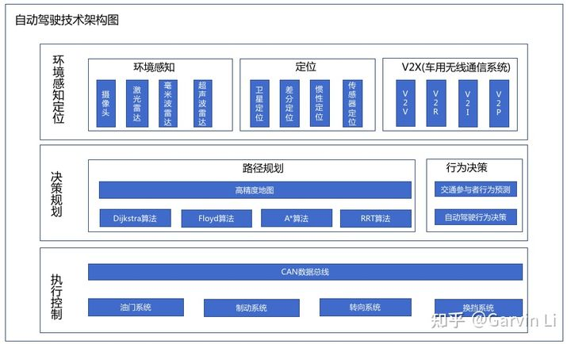

# AutoPilot-Note

# 技术架构

无人驾驶的等级：
- L0，人工驾驶
- L1，辅助驾驶，驾驶员仍为主要掌控者，系统只会在特定的情况下介入。部分自动驾驶，驾驶系统可以完成某些任务，但驾驶员仍然需要实时监控环境。
- L2，部分自动驾驶，驾驶系统可以完成某些任务，但驾驶员仍然需要实时监控环境。部分自动驾驶，驾驶系统可以完成某些任务，但驾驶员仍然需要实时监控环境。
- L3，有条件自动化驾驶，在某些特定情况下，驾驶系统可以完全掌控驾车，暂时解放驾驶员。驾驶员可以在适当的时刻查看手机，但不可以进入深度休息状态，以便在紧急时接收。
- L4，高度自动化， 自动驾驶不再需要用户的紧急应答，可以完全接替用户，用户可以进入完全放松状态。然而这个系统的启动是要满足一定条件，比如天气需晴朗，或者只在高速适用，但和 L3 相比，它的限制条件已大大减少。
- L5，完全自动化，自动驾驶的终极形态，系统在任何情况下都可以安全地掌控汽车，不在再需要用户的介入。

来源：[最全自动驾驶技术架构和综述](https://zhuanlan.zhihu.com/p/372491205)

车上技术组成：
- 环境感知定位
  - 感知
    - 摄像头
    - 激光雷达
    - 毫米波雷达
    - 超声波雷达 
  - 定位 
    - 卫星定位。3角定位
    - 差分定位。
    - 惯性定位。
  - V2R。车间通信
- 决策规划
  - 路径规划。就是求最短距离的图算法。
  - 行为决策
    - 对交通参与方的预测
    - 主车决策
- 执行控制

来源： [两万字详解自动驾驶开发工具链的现状与趋势](https://zhuanlan.zhihu.com/p/471442191)
自动驾驶工具链：
- 数据采集
- 数据存储
- 数据预处理
- 数据挖掘
- 数据标注
  - 外包。人力、服务。 
- 模型训练
- 仿真测试
  - 公司
    - CarMaker 德国IPG公司
    - CarSim 微软
    - PreScan 西门子公司
    - VTD 德国VIRES公司
    - 51Sim-One 国内初创51WORLD
    - Cognata 以色列初创公司
    - Drive Constellation 英伟达
    - 华为八爪鱼
    - 百度Apollo
    - 腾讯TAD Sim
- 部署发布

# 开源项目与资料

资料：
- [apollo自动驾驶课程](https://developer.apollo.auto/devcenter/idpcourse_cn.html)
- [自动驾驶相关各类算法实现及原理分析](https://github.com/dstarer/Robotics)
- [自动驾驶系统demo](https://github.com/ahuer2435/Autopilot_demo)
- [自动驾驶系统实现](https://github.com/sunmiaozju/smartcar)

开源项目：
- 全栈
  - [ApolloAuto](https://github.com/ApolloAuto)
    - [自动驾驶Apollo源码注释](https://github.com/slam-code/apollo) 
  - [autoware](https://www.autoware.org/) 名古屋大学自动驾驶项目
- 仿真
  - [Microsoft/AirSim](https://github.com/Microsoft/AirSim)

# 公司

国内：
- Tier1：科技巨头（华为 百度 大疆 中兴 腾讯（智能座舱/高精地图/仿真工具链））初创公司 （智驾科技 宏景智驾 MINEYE ）
- Robotaxi：百度 小马智行 文远知行 元戎启行 滴滴 momenta Autox 轻舟智航 驭势科技 智行者
- Robotruck：图森未来 智加科技 赢彻科技 小马智行 主线科技 斯年智驾 西井科技 飞步科技 牧月科技（文远知行） 挚图科技 畅行智能 环宇智行 阿里达摩院 希迪智驾 千挂 擎天 行猩 友道智途 Longdrive
- Robobus：百度 文远知行 轻舟智航 商汤 易成
- 物流配送：美团 阿里达摩院 京东 苏宁 中国邮政 百度Apollo 毫末智行（长城） 威盛电子 新石器 白犀牛 智行者 驭势科技 行深智能 一清创新 伽智科技 小狮科技 易成
- 新势力： 蔚来 小鹏 理想 集度 小米 爱驰 零跑 哪吒 智己（上汽） 滴滴 威马
- 主机厂：上汽 广汽 北汽 一汽 长城（毫末智行） 比亚迪 长安 吉利（福瑞泰克） 东风
- 农用自动驾驶：丰疆智能 中联重科 中国一拖 悟牛智能 中科原动力 雷沃重工 超星智能 博创联动 皓行科技
- 矿区自动驾驶：易控智驾 踏歌智行 慧拓智能 路凯智行 伯镭科技 盟识科技
- 环卫自动驾驶：智行者 酷哇 仙途 高仙机器人 深兰科技 浩睿智能 于万智驾
- 泊车：百度 纵目 追势 德赛西威 东软睿驰 禾多科技 纽励科技 恒润科技 领世科技 磨视智能 欧特明 智行者 驭势科技
- 计算平台：华为 地平线 黑芝麻 超星未来 国汽智控
- 高精地图：百度 高德 四维图新 腾讯 华为 滴滴 京东 美团 宽凳 深动 中海庭 亿咖通 .......
- 车路协同：中智行 蘑菇车联 觉非科技 百度 华为 大唐高鸿 华砺智行 阿里 海康

来源： [自动驾驶公司一览表](https://zhuanlan.zhihu.com/p/392964561)

海外：
- Waymo
- Tesla
- Cruise
- Mobileye
- Uber